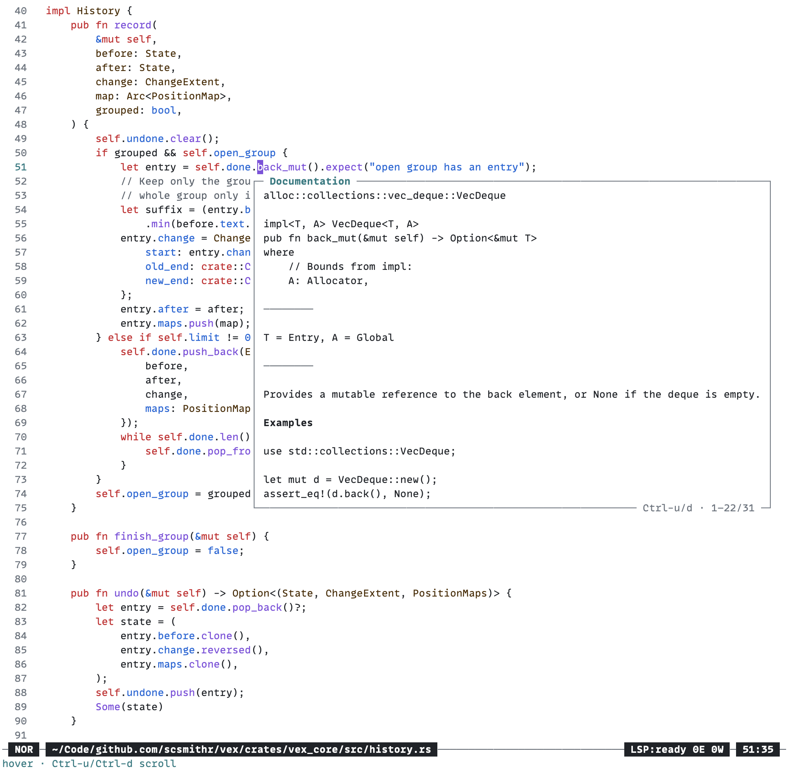

# Vex



A modal text editor inspired by [Helix](https://github.com/helix-editor/helix)
with a smattering of stuff I like from Vim and Emacs.

Text interaction is "noun" then "verb" (as opposed to Vim's "verb" then "noun").

Treesitter and LSP are the backbone of syntax highlighting and code
intelligence.

## LLM disclosure

Much of the code written was LLM assisted. I wouldn't be doing this otherwise.

## Building from source

Building from source requires Rust.

```sh
cargo build --release
```

The binary will be located at `./target/release/vex`.

## Usage

Running `vex` (or `./target/release/vex`) will start the editor.

Vex automatically displays valid keybinds after a key press. Try it with just
`<space>`.

The tutorial can be opened with `:tutorial`.
